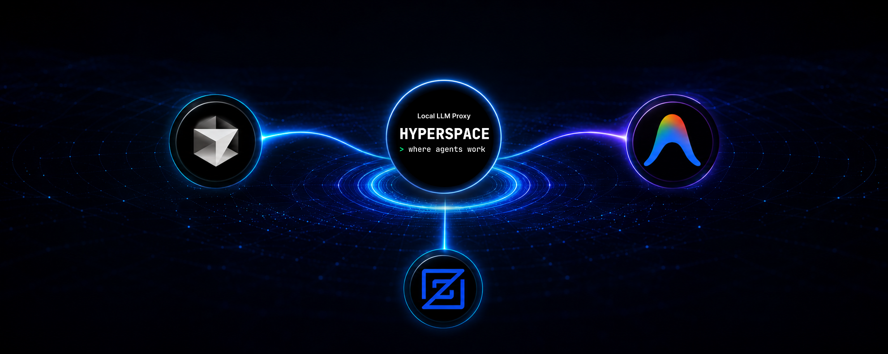

# Hyperspace Bridge

> Connect **Cursor**, **Antigravity IDE**, and **Zed** to Claude via your local **Hyperspace (Hai) proxy** — with live web search and full coding capabilities.

[](LICENSE)
[](https://www.apple.com/macos/)
[](https://nodejs.org/)

---

## What is this?

The **Hyperspace Bridge** is a small local server that makes Claude available inside your IDE. It sits between your IDE and the Hyperspace (Hai) proxy, translating requests so that any editor which speaks to a local AI can use Claude through your existing Hyperspace setup — with zero manual configuration.

> **Analogy:** Think of it as a power adapter when travelling. Your laptop plug (the IDE) is one shape, the wall socket (Hyperspace) is another shape. The bridge is the adapter — nothing changes about the laptop or the wall.

Once running, **ANY local AI tool** that speaks Ollama or OpenAI auto-detects your Hyperspace setup as if it were a local Ollama server. No more cloud SaaS lock-in to Cursor/Copilot/etc. — your editor uses Claude through your own corporate proxy, with proper licensing and zero data leak risk.

---

## How it works — architecture & data flow

```
Your IDE (Cursor / Antigravity / Zed)
         │
         ↓  Chat request
  Hyperspace Bridge          ← this project
  (runs on your Mac,
   auto-starts on login)
         │
         ↓  Anthropic Messages API
   Hyperspace (Hai) proxy
   (already running locally)
         │
         ↓  Anthropic relay
  Claude  (Sonnet / Haiku / Opus)
         +  Live web search via Tavily
```

The bridge exposes two local endpoints:
- **Port 11434** — Ollama-compatible (auto-detected by Zed and Continue.dev)
- **Port 11435** — OpenAI-compatible (for any tool with a custom base URL)

Both ports bind to `127.0.0.1` only — not reachable from your network.

### Auto-detection of your Hai API key

The bridge looks for your `ANTHROPIC_AUTH_TOKEN` in this order:

1. `$HAI_API_KEY` environment variable (if set)
2. `$ANTHROPIC_AUTH_TOKEN` environment variable (if set)
3. `~/.claude/settings.json` → `env.ANTHROPIC_AUTH_TOKEN` (where `hai configure claude-code` writes it)

If `hai configure claude-code` has been run — which is the standard Hyperspace setup — the key is already in place and the bridge picks it up automatically.

---

## What is Continue.dev?

**Continue** ([continue.dev](https://continue.dev)) is an open-source AI coding assistant that runs as an extension inside your IDE — a chat panel + autocomplete + inline-edit tool that lives alongside your code.

The key difference: **you choose where its AI comes from.** Unlike Cursor's built-in chat (locked to Cursor's cloud) or Antigravity's Agent (locked to Google's Cloud Code), Continue lets you point it at any AI provider — including the local Hyperspace Bridge.

### How Continue knows about Hyperspace

Continue is configured via `~/.continue/config.yaml`:

```yaml
models:
  - name: Claude Sonnet (Hyperspace)
    provider: ollama              # ← Continue speaks Ollama protocol
    model: claude-sonnet-latest
    apiBase: http://localhost:11434   # ← talks to YOUR bridge
    roles: [chat, edit, apply]
```

Continue thinks it's talking to a local Ollama server. The bridge is pretending to be Ollama. Hai is what actually returns Claude responses. Continue doesn't know or care — it just sees a working backend.

> **In one sentence:** Continue is the AI sidebar inside your IDE that we pointed at the Hyperspace Bridge — so when you press ⌘L in Antigravity, Claude responds via your corporate Hai proxy instead of via Google's cloud.

### Why we use it for Antigravity and Cursor

Both Antigravity IDE and Cursor **hard-wire their built-in AI to their own cloud**. There is no setting to redirect them to a local proxy. Continue.dev sidesteps this — it runs as a regular extension inside the IDE, uses its own AI pipeline, and that pipeline is fully configurable.

| IDE | Built-in AI | What we use instead |
|---|---|---|
| **Cursor** | cursor.sh cloud (quota-limited) | Continue sidebar (⌘⇧L) |
| **Antigravity IDE** | Google Cloud Code Assist (gRPC, closed) | Continue sidebar (⌘L) |
| **Zed** | ✅ Native Ollama support | Built-in, no extension needed |

---

## Why it's a good fit for your team

| Property | Why it matters |
|---|---|
| **Open source** | Apache 2.0 license — no SaaS subscription, no per-seat cost |
| **Same config everywhere** | One `~/.continue/config.yaml` works in Cursor, Antigravity, Zed, VS Code, JetBrains |
| **No data leaves your Mac** | All traffic goes through your existing Hyperspace proxy — same path as Claude Code in Terminal |
| **No data stored** | The bridge is stateless — every request is translated and forwarded live. Nothing is cached, saved, or written to disk. |
| **Tool use / Agent mode** | Claude can read files, run terminal commands, apply patches across multiple files |
| **One-command install** | `./install.sh` detects everything and sets it all up — no manual steps |
| **Auto-starts on login** | launchd keeps the bridge running — nothing to babysit |

---

## Features

| Feature | Status |
|---|---|
| Claude Sonnet, Haiku, Opus via Hyperspace | ✅ |
| Cursor — Continue.dev sidebar | ✅ |
| Antigravity IDE — Continue.dev sidebar | ✅ |
| Zed — native Assistant panel | ✅ |
| VS Code / JetBrains / Neovim / CLI tools | ✅ |
| Live web search (Tavily MCP) | ✅ optional |
| Auto-detect Hyperspace API key | ✅ |
| Auto-detect Node.js (nvm / Homebrew / system) | ✅ |
| Auto-start on login (launchd) | ✅ |
| Green "Hyperspace" status indicator in IDE | ✅ |
| 127.0.0.1 only — LAN-isolated | ✅ |
| Zero npm dependencies (bridge itself) | ✅ |

---

## Quick Start

### Install

```bash
# 1. Clone this repository
git clone https://github.com/Venelinhr/Hyperspace-Multi-IDE-Bridge.git
cd Hyperspace-Multi-IDE-Bridge

# 2. Run the installer — detects everything automatically
./install.sh

# 3. Open your IDE and start chatting
#    Cursor / Antigravity: press ⌘L or ⌘⇧L to open Continue
#    Zed: press ⌘? to open the Assistant panel
```

The installer will:
- Detect Node.js (nvm, Homebrew, or system)
- Auto-detect your Hyperspace API key from `~/.claude/settings.json`
- Prompt for an optional Tavily web search key (free)
- Write `~/.continue/config.yaml` with all models pre-configured
- Install Continue.dev + YAML extension in Cursor and Antigravity
- Register the bridge as a launchd agent (auto-starts on every login)
- Run health checks and confirm everything is working

### Remove

```bash
./uninstall.sh
```

This stops the bridge, removes the launchd agent, and removes `~/.hyperspace-bridge/`. Your `~/.continue/config.yaml` is kept.

> **Privacy:** No data is stored. All traffic is local — the bridge is a stateless proxy. Nothing is logged except method, path, HTTP status, and response time. No conversation content ever touches disk.

---

## Requirements

- macOS 13+
- Node.js 18+ (`brew install node` or nvm)
- Hyperspace (Hai) proxy running locally (`hai proxy start`)
- `hai configure claude-code` already run once

---

## Tavily web search — live data in Agent mode

By default Claude has no real-time data. **Tavily** gives Claude live internet access inside Continue's Agent mode — weather, news, documentation lookups, anything time-sensitive.

- **Free tier:** 1,000 searches/month, no credit card needed
- **Get a key:** [app.tavily.com](https://app.tavily.com) → sign up → copy your `tvly-...` key
- **Setup:** the installer prompts for the key during `./install.sh`

Once configured, just ask in Agent mode:
```
Latest world news?
current AAPL stock price?
```
Claude calls Tavily automatically and returns real results.

---

## Hyperspace status indicator in the IDE status bar

When the bridge is running, a green **"Hyperspace"** label appears in the IDE status bar (bottom right, next to "Continue"). When the bridge stops, it disappears. No dot, no icon — just the word in green.

- Polls `localhost:11434/health` every 15 seconds
- First check runs immediately at IDE startup
- Cost: ~1ms loopback request every 15s — negligible

---

## IDE Compatibility

### Cursor
**Method:** Continue.dev extension · **Shortcut:** ⌘⇧L

Cursor's native Agent panel ("New Agent / Automations") routes through `cursor.sh` — this cannot be redirected. The bridge provides a full alternative via Continue's sidebar with equivalent capabilities (file edits, terminal, multi-file diffs, web search).

### Antigravity IDE
**Method:** Continue.dev extension · **Shortcut:** ⌘L

Antigravity's built-in Agent uses Google Cloud Code Assist via gRPC with proprietary Protobuf schemas — a completely different protocol that cannot be redirected. Continue provides equivalent functionality.

> Note: Antigravity's native Agent already uses Claude Sonnet 4.6 via Google's hosted Claude. If you prefer to use that instead, it works independently of the bridge.

### Zed
**Method:** Native `language_models.ollama` config · **Shortcut:** ⌘?

Zed has first-class support for Ollama. Add to `~/.config/zed/settings.json`:
```json
"language_models": {
  "ollama": {
    "api_url": "http://localhost:11434",
    "available_models": [
      {
        "name": "hyperspace",
        "display_name": "Claude (via Hyperspace)",
        "max_tokens": 200000
      }
    ]
  }
},
"agent": {
  "default_model": { "provider": "ollama", "model": "hyperspace" }
}
```

### Any tool with a custom AI endpoint ✅

Any tool that lets you set an Ollama URL or OpenAI base URL works with the bridge:

```bash
# OpenAI-compatible tools (CLI, scripts, etc.)
export OPENAI_BASE_URL=http://localhost:11435/v1
export OPENAI_API_KEY=sk-not-needed
```

**Examples:** JetBrains AI Assistant, Helix, Neovim plugins (`llm.nvim`, `codecompanion.nvim`), CLI tools — point them at `localhost:11434` (Ollama) or `http://localhost:11435/v1` (OpenAI). The bridge handles them all.

---

## Install from scratch — for your team

Each teammate runs `./install.sh` on their own Mac. The installer:

1. Detects Node.js (nvm, Homebrew, or system)
2. Auto-detects the Hyperspace API key from `~/.claude/settings.json`
3. Prompts for an optional **Tavily** web search key
4. Writes `~/.continue/config.yaml` with all models pre-configured
5. Installs Continue.dev + YAML extension in Cursor and Antigravity automatically
6. Registers the bridge as a launchd agent (auto-starts on every login)
7. Runs health checks and prints the result

No shared server. Each person connects to their own Hyperspace proxy.

```bash
git clone https://github.com/Venelinhr/Hyperspace-Multi-IDE-Bridge.git
cd Hyperspace-Multi-IDE-Bridge
./install.sh
```

---

## Security model

| Property | Detail |
|---|---|
| **No data stored** | The bridge is stateless — every request is translated and forwarded live. Nothing is cached, saved, or written to disk. All processing is local. |
| **Network exposure** | Both ports bind to `127.0.0.1` only — unreachable from your network. Verified: connecting from a LAN IP is refused. |
| **API key handling** | Bridge never stores keys. Reads the token at startup from `~/.claude/settings.json`. Forwarded as a header on each request. |
| **Logging** | Logs only method, path, HTTP status, and latency. No request or response content is ever logged. |
| **Dependencies** | Zero npm packages — uses Node's built-in modules only. No supply-chain surface. |
| **Process isolation** | Runs as your user via launchd. No root, no sudo. |

---

## Troubleshooting

**Bridge not responding:**
```bash
launchctl bootout gui/$(id -u)/com.hyperspace.bridge 2>/dev/null || true
launchctl bootstrap gui/$(id -u) ~/Library/LaunchAgents/com.hyperspace.bridge.plist
curl http://localhost:11434/health
```

**View logs:**
```bash
tail -f ~/Library/Logs/hyperspace-bridge.log
```

**Agent mode sends nothing (silent):**
Install the YAML extension — Continue requires it:
```bash
"/Applications/Cursor.app/Contents/Resources/app/bin/cursor" --install-extension redhat.vscode-yaml
```

**Full troubleshooting guide:** [docs/TROUBLESHOOTING.md](docs/TROUBLESHOOTING.md)

---

## Documentation

| Doc | Description |
|---|---|
| [docs/INSTALL.md](docs/INSTALL.md) | Detailed installation guide |
| [docs/SETUP.md](docs/SETUP.md) | Auto-detection flow with expected output |
| [docs/FEATURES.md](docs/FEATURES.md) | Capabilities and usage examples |
| [docs/TROUBLESHOOTING.md](docs/TROUBLESHOOTING.md) | Common issues and solutions |
| [docs/FAQ.md](docs/FAQ.md) | Frequently asked questions |
| [docs/COMPATIBILITY.md](docs/COMPATIBILITY.md) | IDE compatibility details |
| [CHANGELOG.md](CHANGELOG.md) | Version history |
| [CONTRIBUTING.md](CONTRIBUTING.md) | How to contribute |

For a visual guide: open [docs/guide.html](docs/guide.html) in your browser.

---

## License

MIT — see [LICENSE](LICENSE)

## Acknowledgements

Built on top of [Hai CLI](https://github.com/sap/hai) and [Continue.dev](https://continue.dev).
